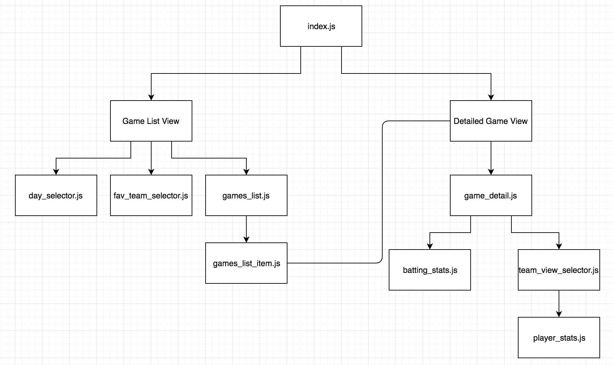

# The Best MLB Scoreboard

The MLB scoreboard pulls data from http://gd2.mlb.com/ and populates the appropriate relevant information for a game.
This application has the ability to check game stats and detailed game information from any date in the past. You can jump to a particular date, or increment/decrement the date and it'll retrieve the relevant data as you go along.
It also has the ability to sort according to the preferred team.


The two views in this application includes the list of games and a more detailed view of the game.

The app is constructed using index.js as the main JS that interacts with the sub-components.

For the main list view, it interacts with GamesList, DaySelector and FavTeamSelector.

For the detailed game view, it interacts with GameDetail, TeamViewSelector, BattingStats, PlayerStats.




## Quickstart Guide:
In this directory, run the following command:
```
npm install
```

Following that, run this command:
```
npm start
```

After which, head to your browser and head to this link.
```
http://localhost:8080/
```


Please note that I knew nothing about baseball going into this, so the variable names might be somewhat weird.
Thank you for giving me the opportunity to interview with Konrad Group!


